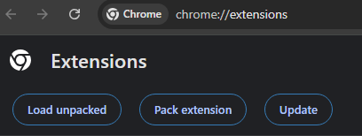

# Locked In — AI

**Locked In — AI** is the a Deep Work Logger and Focus Helper, it uses AI to  intelligently analyse your browsing distractions given your current goals. For if your goal is studying for a maths test you can watch a youtube video on quadratics but it will block unrelated gaming videos. So you can still use youtube without getting distracted. Or any other open website like google or Instagram. 

Also theres a leaderboard. Come compete against me!

## Installation

1.  **Download the Extension:** Go to the [Releases](https://github.com/ScrapMetal1/Locked-IN-AI/releases/tag/V1.1) page and download the `dist.zip` file.
2.  **Unpack the file:** Extract the contents of the ZIP folder to a location on your computer.
3.  **Enable Developer Mode:** Open Google Chrome and navigate to `chrome://extensions/`. In the top-right corner, toggle the **Developer mode** switch to **ON**.
4.  **Load the Extension:** Click the **Load unpacked** button as shown below and select the folder you just extracted.
5.  **Pin for Easy Access:** Click the puzzle piece icon in your Chrome toolbar and pin **Locked In — AI** for quick access.

## Optimisation Side Quest

### Caching and predefined blocklists (Chrome Storage API)
**What was improved:** Reduced database reads, network latency, and API costs.
**How it works:** Instead of querying the remote database (Firebase) on every tab navigation, the extension caches the `userState`, `blocklist`, and `allowlist` locally using `chrome.storage.local`. 
**Results:** Tab analysis times dropped from ~300ms (network request) to `<10ms` (local read), resulting in instant blocking of distracting sites without noticeable browser lag. The background service worker employs an early-exit algorithm when a tab updates. It first checks the cached `isLockedIn` state and the local `allowlist` / `blocklist`. If a user isn't locked in, or if the URL matches a predefined list, the function returns immediately.
**Results:** Prevents the heavy `analyzeUrl` (LLM) function from running unnecessarily, which saves device battery life, reduces memory spikes, and prevents hitting Vertex AI rate limits.
## License & Legal
**Copyright (c) 2026 EliasCorp. All Rights Reserved.**
